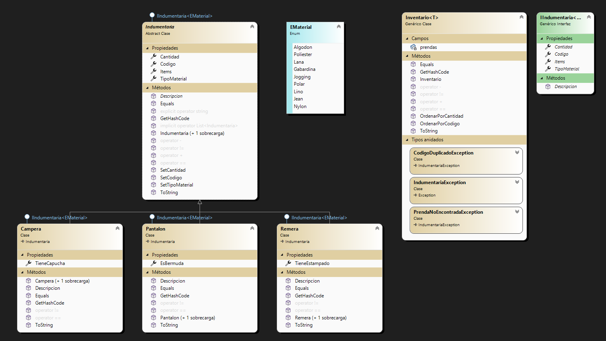

# Cordoba.Rodrigo.PrimerParcial 

# Titulo: CRUD - Indumentaria

## Sobre mi
Soy Rodrigo Cordoba, tengo 21 años, estudio Tecnicatura Universitaria en Programacion en UTN.

## Resumen
La aplicacion Crud - Indumentaria es una herramienta diseñada para realizar la carga de productos de indumentaria los cuales seran agregados a una lista y podran ser tanto modificados como eliminados de la misma. A la aplicacion se ingresa utilizando un correo y contraseña cargados previamente en un archivo de tipo .JSON y luego son validados para ingresar a la aplicacion.

### Uso de la aplicacion:
1. Ingresa utilizando un correo y contraseña validos cargados en el archivo MOCK.JSON.
2. Una vez dentro de la aplicacion, puedes presionar el boton "Salir" donde estaran las opciones cerrar sesion para cambiar de usuario o cerrar el programa.
3. Agrega un nuevo producto a la lista presionando el boton verde "Agregar". Se abrira una ventana para ingresar los detalles del producto.
4. Para modificar un producto, seleccionalo de la lista y presiona el boton amarillo "Modificar". Se abrira una ventana emergente para editar los atributos del producto.
5. Para eliminar un producto, seleccionalo de la lista y presiona el boton rojo "Eliminar". Confirma la accion en la ventana emergente.
6. Ordena los productos por tipo ("Pantalon", "Campera", "Remera") y cantidad presionando el boton "Ordenar".
7. Serializacion en la barra superior desplegara 4 opciones, "guardar xml", la cual guardara la lista de elementos en un archivo xml; "guardar json" hara lo mismo peor en archivo tipo json; "cargar xml" cargara la lista guardada previamente con sus respectivos valores; "cargar json" realizara lo mismo pero del archivo json guardado.

## Diagrama de clases

## Script sql
Puedes encontrar el script SQL en la carpeta `sql_scripts` dentro de este repositorio: `sql_scripts/script.sql`.
